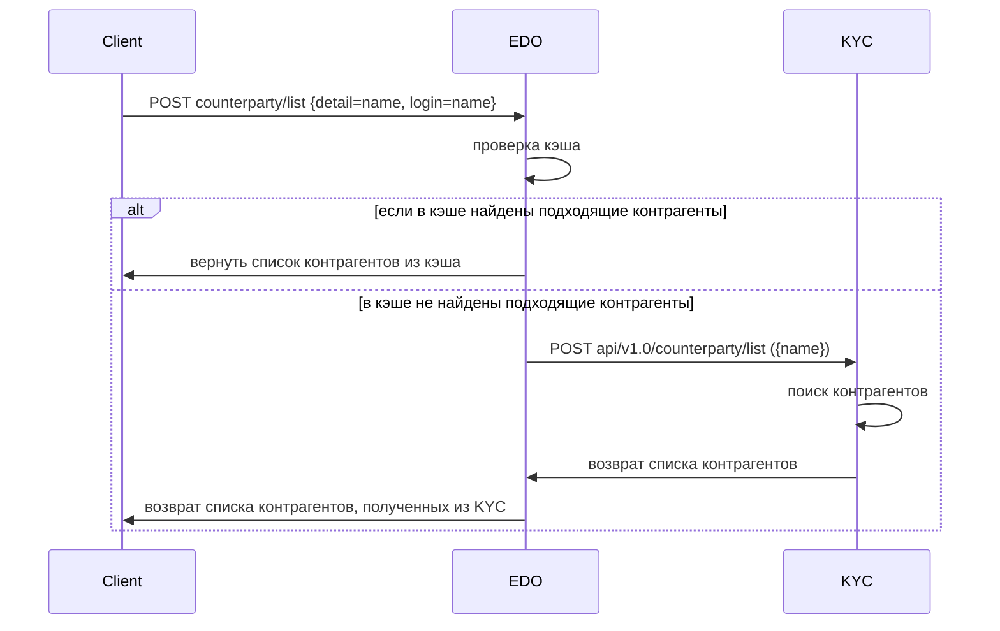

### Получение списка контрагентов
В ЭДО данная операция происходит, например, при поиске адресатов документа.

Получение списка контрагентов состоит из следующих шагов:
1. Клиент -> ЭДО: Запрос списка контрагентов. Запрос **POST counterparty/list**;
2. ЭДО: Поиск контрагентов кэше;
3. ЭДО -> KYC: Запрос списка контрагентов. Запрос **POST api/v1.0/counterparty/list**;
4. KYC -> Клиент: Возврат списка найденных контрагентов.

#### 1. POST counterparty/list ({detail=name, login=name})
В качестве параметров отправляется вводимое имя. 

Может вернуть список контрагентов (см. шаг 4) или ошибку - "422. Invalid Parameters".

#### 2. Поиск контрагентов в кэше
ЭДО проверяет есть ли совпадения с вводимым именем в кэше и, если имеется, возвращает список контрагентов из кэша, иначе запрашивает информацию с KYC.

#### 3. POST api/v1.0/counterparty/list ({name, inn, kpp, email})
Запрос происходит, только если в кэше ЭДО отсутствуют подходящие контрагенты.
В качестве отправляемых значений используется пользовательский ввод. 
Каждый из параметров является опциональными и может отсутствовать. 

KYC возвращает список подходящих шаблону контрагентов в следующем виде:
```json
[
  {
    "country": "Российская Федерация",
    "uid": "3fa85f64-5717-4562-b3fc-2c963f66afa6",
    "role": {
      "uid": "3fa85f64-5717-4562-b3fc-2c963f66afa6",
      "counterparty": "3fa85f64-5717-4562-b3fc-2c963f66afa6",
      "name": "string",
      "tsfrom": "2022-02-04T04:50:12.117Z",
      "tsto": "2022-02-04T04:50:12.117Z",
      "roletype": {
        "sid": "string",
        "name": "string"
      }
    },
    "name": "string",
    "isorg": true,
    "detail": [
      {
        "uid": "3fa85f64-5717-4562-b3fc-2c963f66afa6",
        "system": {
          "uid": "string",
          "systemtype": {
            "sid": "string",
            "name": "string"
          },
          "name": "string",
          "ip": "string"
        },
        "counterparty": "string",
        "detailtype": {
          "uid": "3fa85f64-5717-4562-b3fc-2c963f66afa6",
          "name": "string",
          "data": "string",
          "description": "string",
          "counterparty": "3fa85f64-5717-4562-b3fc-2c963f66afa6",
          "formtype": "string"
        },
        "tsfrom": "2022-02-04T04:50:12.117Z",
        "tsto": "2022-02-04T04:50:12.117Z",
        "data": "string"
      }
    ]
  }
]
```
Также этот список может быть пустым.

#### 4. Возврат списка клиенту
EDO возвращает список найденных пользователей. Ответ от сервиса выглядит следующим образом:
```json
[
  {
    "uid": "3fa85f64-5717-4562-b3fc-2c963f66afa6",
    "name": "string",
    "email": "string",
    "detail": [
      "string"
    ]
  }
]
```

### Схема получения списка контрагентов по вводимому имени для ЭДО



### Добавление контрагента
Это вспомогательная операция, выполняемая во время логина пользователя в ЭДО при условии, что у пользователя не указан контрагент или текущее подразделение (то есть, если это не сотрудник).

Добавление контрагента состоит из следующих шагов:
1. Клиент -> ЭДО: Запрос на добавление контрагента. Запрос **POST /counterparty/client/set**;
2. ЭДО -> KYC: Поиск роли и ее получение с KYC. Запрос **POST api/v1.0/role/find ({name='country'})**;
3. ЭДО -> KYC: Получение списка контрагентов по указанной роли. Запрос **GET api/v1.0/counterparty/list ({role = role_uid})**;
4. ЭДО: Фильтрация списка, полученного на прошлом шаге, и поиск контрагентов текущей страны (по умолчанию Российская Федерация);
5. ЭДО -> KYC: Поиск роли агента. Запрос **POST api/v1.0/role/find ({name='per', counterparty=counterparty_uid})**, где counterparty_uid - uid контрагента текущей страны;
6. ЭДО -> KYC: Получение данных о person и агенте. Из ответа KYC нас интересует **_person.uid_**. Запрос **GET api/v1.0/agent/person ({agent=sub})**, (где sub получен по запросу /oauth/userinfo);
7. ЭДО -> KYC: Получение данных о контрагенте по uid person. Запрос **GET api/v1.0/person/counterparty/list ({person=person_uid})**;
8. ЭДО -> KYC: Обновить таблицу, связывающую данный сервис, контрагента, агента и роль (table counterparty_client). Запрос **POST api/v1.0/counterparty/client/update**;
9. ЭДО -> KYC: Если предыдущий запрос вернул обновленные данные, то запрашиваем обновиться еще раз с возвращенным uid. Запрос **POST api/v1.0/counterparty/client/update**;
10. ЭДО -> KYC: Если предыдущий запрос (п. 8) не вернул обновленные данные, то запрашиваем добавление строки в соответствующую таблицу. Запрос **POST api/v1.0/counterparty/client/add**;
11. ЭДО -> Клиент: Возврат добавленных данных о контрагенте.
