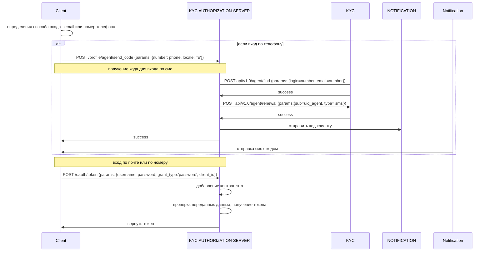

### Логин
ЭДО поддерживает способы входа:
   * по логину и паролю,
   * по номеру телефона и коду.

При входе по паролю пользователю необходимо ввести свои логин и пароль в соответствующие поля формы входа. 
При входе по номеру пользователь сперва вводит зарегистрированный номер, выбирает страну, в которой зарегистрирован номер телефона, и запрашивает код. 
На указанный номер в течении некоторого времени приходит смс с кодом, с помощью которого пользователь может войти в ЭДО.
Под **кодом** здесь понимается набор цифр, отправляемый пользователю при попытке логина по смс на введенный номер телефона, который в дальнейшем используется для входа в ЭДО.

Кратко опишем процесс входа в ЭДО.
1. Клиент определяет способ входа пользователя - по почте или по телефону. 
2. В случае входа по телефону запрос вначале необходимо запросить код по смс. Запрос происходит на KYC.AUTHORIZATION-SERVER и выглядит следующим образом: **POST /profile/agent/send_code**, передавая свой номер телефона и локаль в качестве параметра {number: phone, locale: 'ru'}.
3. *KYC.AUTHORIZATION-SERVER ищет агента по полученному номеру, отправляя запрос **POST api/v1.0/agent/find** в KYC и передавая номер телефона в качестве логина и почты ({login=number, email=number}).
4. *Если получение агента прошло успешно, то KYC.AUTHORIZATION-SERVER запрашивает обновленный код от KYC (**POST api/v1.0/agent/renewal** с параметрами ({sub=uid_agent, type='sms'}).
5. *KYC.AUTHORIZATION-SERVER проверяет, что код успешно пришел и отправляет запрос сервису уведомлений на отправку полученного кода по смс. Возвращает клиенту
   {success=true} или ошибку.
6. *Пользователь получает смс с кодом от сервиса уведомлений.
7. Пользователь пытается войти в ЭДО, и клиент отправляет логин и пароль\код в KYC.AUTHORIZATION-SERVER по запросу **POST /oauth/token**, и в KYC.AUTHORIZATION-SERVER происходит добавление контрагента (см. [counterparty.md](/docs/other/counterparty.md);
8. KYC.AUTHORIZATION-SERVER проверяет соответствие передаваемых данных, получает токен, возвращает клиенту токен.

В итоге после успешного логина на клиенте хранится bearer токен пользователя, используемый для дальнейших запросов.

### Схема регистрации для ЭДО

Подробнее о реализации логина на сервисе и проверки аутентификации пользователя представлено 
[здесь](https://gitlab.get-net.ru/docs/private/kyc/-/blob/master/service/README.md).
